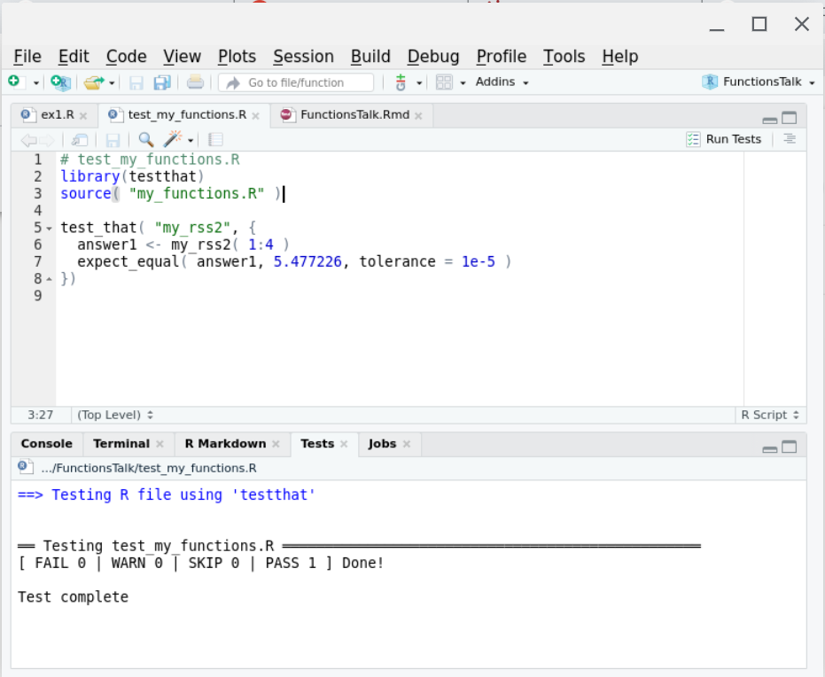
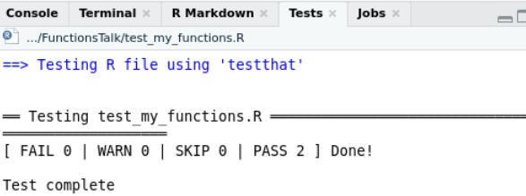

```{r setup, include=FALSE}
knitr::opts_chunk$set(echo = FALSE)
suppressPackageStartupMessages({
  library(dplyr)
  library(tidyr)
  library(ggplot2)
  library(DiagrammeR)
})
```

## Outline

- From script to function...
- Three kinds...
- What's in a name...

---

class: title-slide, middle, inverse

## .center[From script to function...] 

---

## What is a function?

In R, functions are objects containing code that can be executed to do useful things. An example of a useful function in R is the `mean` function:

```{r, echo=TRUE}
x <- 1:4
x
result <- mean( x )
result
```


```{r mean_diagram1}
grViz(
'digraph function {
rankdir = LR
node [shape=none]
x
result
node [shape=oval]
x -> mean [label="[numeric vector]"]
mean -> result [label="[length 1 vector]"]
}
'
, width=600
, height=100
)
```

---

## Some code to re-use

Suppose you have figured out how to compute the root-sum-square of some numbers, and now you want to be able to easily apply this algorithm to new data. This particular example is intentionally very small... we will look at more involved examples later.

```{r rss1, echo = TRUE}
y <- x^2
y
ysum <- sum( y )
ysum
result <- sqrt( ysum )
result
```

---

## Wrap your code in a function definition

```{r my_rss1,echo=TRUE}
my_rss1 <- function() { # first added line
y <- x^2                # untouched code
y                       # untouched code
ysum <- sum( y )        # untouched code
ysum                    # untouched code
result <- sqrt( ysum )  # untouched code
result                  # untouched code - value to return
}                       # second added line
my_rss1()               # test the new function my_rss1
```

This lets us type `my_rss1()` to do all the work of those "untouched code" lines in one short step.

But one thing to notice about this is that we haven't defined any arguments yet... the code is using the `x` variable that we had defined in the global environment from earlier. This is a problem because remembering to create that variable before calling this function is hard.

---

## What if we forget?

```{r test_my_rss1, echo=TRUE, eval=FALSE, error=TRUE}
rm( x ) # What if the x variable doesn't exist?
my_rss1() # call function again, but don't have
          # global variable x defined
```

```
Error in my_rss1() : object 'x' not found
```

We normally identify the outside variables we want (parameters) with internal names in the function (arguments) to make it clear what information the function needs as input...

---

## Adding arguments

Let's indent the "untouched code" to make the end of the function easier to find, and add an `x` argument:

```{r my_rss2,echo=TRUE}
my_rss2 <- function( x ) { # first added line with argument
  y <- x^2                 # indented code
  y                        # indented code
  ysum <- sum( y )         # indented code
  ysum                     # indented code
  result <- sqrt( ysum )   # indented code
  result                   # indented code - value to return
}                          # end of function body
                           # global x still missing
my_rss2( 1:4 )             # test the new function my_rss2  ...
```
In the call to `my_rss2( 1:4 )` we are directly specifying the input as a parameter instead of using a global variable.

---

## Passing parameters, receiving arguments

We can define and specify a global variable, but we no longer _have to_ define it with a special name.

```{r test_my_rss2, echo=TRUE}
x2 <- 2:5
my_rss2( x2 )
```
In this case, `x2` is a variable outside the function, but inside the function the code thinks `x1` is called `x` because that is the first argument name.

---

## Returning results

The result of any function is either the last expression in the function (`result` in our function) or the parameter passed to the `return()` function. In most cases it is easier to follow logic that flows all the way to the end of the function, but sometimes it is necessary to bail out in the middle of a loop or `if` statement.

```{r return_example, echo=TRUE}
return_example <- function( s ) {
  # s is assumed to be a length-1 string
  if ( "special" == s ) {
    return( TRUE )
  }
  FALSE
}
return_example( "nothing special" )
return_example( "special" )
```

---

## Side effects

All of the variables normally assigned to within a function are local to that function... that is, even if there are similarly-named global variables. It is possible to modify global variables using `<<-` assignment, but that causes that code to be extremely "surprising" to other users or yourself in the future, so such "side effects" should really be avoided.

If you have multiple answers to return, put them into a list and return the list:

```{r return_2_results, echo=TRUE}
return_2_results <- function( x ) {
  y <- 2 * x
  z <- x^2
  list( result1 = y, result2 = z )
}
result <- return_2_results( 3:5 )
result$result1
result$result2
```


---

## Testing our function 1

Each time we modify our function, we risk introducing a bug that causes previously-correct results to be incorrectly-generated in our modified function. There is a way to find such problems, though, using the `testthat` package. Suppose we put our `my_rss2` function into its own file called `my_functions.R`:

```{r, echo=TRUE, eval=FALSE}
# my_functions.R
my_rss2 <- function( x ) { # first added line with argument
  y <- x^2                 # untouched code
  y                        # untouched code
  ysum <- sum( y )         # untouched code
  ysum                     # untouched code
  result <- sqrt( ysum )   # untouched code
  result                   # untouched code
}                          # end of function body
```

---

## Testing our function 2

We then normally use `my_rss2` from a different file, called `my_script.R`:

```{r, echo = TRUE, eval=FALSE}
# my_script.R
source("my_functions.R")

x2 <- 2:5
my_rss2( x2 )
```

where the `source` function effectively enters the function definitions in `my_functions.R` (only `my_rss2` in this case) into the global environment.

---

## Testing our function 3

Finally, we create a file that checks certain answers that your function produces:

```{r, echo = TRUE, eval=FALSE}
# test_my_functions.R
library(testthat)
source( "my_functions.R" )

test_that( "my_rss2", {
  answer1 <- my_rss2( 1:4 )
  expect_equal( answer1, 5.477226, tolerance = 1e-5 )
})
```

we can run this file whenever we make a change to my_rss2 and it will confirm that it still gives the expected answer. Ideally you would obtain this "correct" answer using something different than R (a calculator?) but at the very least you can use the first value you get back and in the future if it changes you can investigate why.

---

.center[]

---

## Cleanup our function

Typing an expression at the console prints the result, but inside a function the only place an expression on its own has an effect is on the last line of the function, so we can clean up the function a bit:

```{r, echo=TRUE}
# my_functions.R
my_rss3 <- function( x ) { # first added line with argument
  y <- x^2                 # untouched code
  ysum <- sum( y )         # untouched code
  sqrt( ysum )             # don't bother to put the result
                           # into a variable 
}                          # end of function body
```

---

## Testing our cleaned-up function

Here I am creating a new function, but if you just edited the existing function then you could re-use the test directly:

```{r, echo = TRUE, eval=FALSE}
# test_my_functions.R
library(testthat)
source( "my_functions.R" )

test_that( "my_rss2", {
  answer1 <- my_rss2( 1:4 )
  expect_equal( answer1, 5.477226, tolerance = 1e-5 )
})
test_that( "my_rss3", {
  answer1 <- my_rss3( 1:4 )
  expect_equal( answer1, 5.477226, tolerance = 1e-5 )
})
```

---

.center[]

---

class: title-slide, middle, inverse

## .center[Three kinds...] 

---

## Input, analysis, and output

When you have a script that you want to convert to a function, you should always try to break the script into these categories of code and convert only one kind of code section at a time. That is, if you want the functions to be re-usable:

- Input functions should return data objects (usually data frames) directly corresponding to input information
- Analysis functions should transform data objects from one kind to another (e.g. detail data frames into summary data frames); and
- Output functions should be the only ones that produce side effects like creating new files or transmitting data to a website or displaying a plot on a screen.

```{r mean_diagram2}
grViz(
'digraph function {
rankdir = LR
node [shape=none]
"data.xlsx"
"result.docx"
node [shape=oval]
"data.xlsx" -> Input [label="[file]"]
Input -> Analysis [label="[data.frame]"]
Analysis -> Output [label="[list of data.frames]"]
Output -> "result.docx" [label="[file]"]
}
'
, width=600
, height=100
)
```


---

## Super-functions are brittle

Functions that do two of or all three of these categories of work tend to be brittle and don't get re-used as much. It is very nearly as easy to enter an input function call, followed by an analysis function call, followed by an output function call, rather than invoking a super-function in one line... and the three-line version is much easier to adapt when you need to work with a different input sources (e.g. CSV, xlsx, database, web scraping, shiny interactive input, etc.) or produce a different kind of output (e.g. Rmd reports, or Excel summary files, or shiny pages, etc.).

```{r mean_diagram3}
grViz(
'digraph function {
rankdir = LR
node [shape=none]
"data.xlsx"
"result.docx"
node [shape=oval]
"data.xlsx" -> "Super-Function" [label="[file]"]
"Super-Function" -> "result.docx" [label="[file]"]
}
'
, width=600
, height=100
)
```

---

class: title-slide, middle, inverse

## .center[What's in a name...] 

---

## Functions are objects?

So functions are objects, similar to the way we have defined the `x` object. If we type `my_rss3` at the console, the R interpreter prints the object:

```{r, echo=TRUE}
my_rss3
```

Functions that are compiled C code or S3 methods are a bit more obscure than this, but failing to type the parentheses when intending to call the function is a common source of confusion for new R users.

---

## Anonymous functions

One thing you don't see come out when you print a function is the name of the function. In the same way the vector `1:3` could be in variable `x` or variable `z` or be typed in literally as an expression, functions don't need to know what they are called to do their job. They can be renamed:

```{r, echo=TRUE}
my_rss <- my_rss3
my_rss( 3:6 )
```

or they can have no name at all:

```{r, echo=TRUE}
(function(x) sqrt(2*x) )(1:3)
```

in which the first parenthesis is an expression defining a function but not giving it a name, followed by a pair of parentheses that cause the function to be called with a vector of numbers.

---

## Example of a tough input file

Sometimes the built-in functions are not quite flexible enough to support reading in a file without some help. One example is CSV files with extra lines (empty or not) between the header line and the data:

```{r,echo=TRUE,eval=TRUE}
cat( paste( readLines( "data/spacy_1.csv", n = 4 )
          , collapse = "\n"
          )
   )
```

---

## A workaround

With a bit of Googling we can experiment until we create code that can read one of these files by reading the text lines into a vector, deleting the troublesome line, and then setting up a "connection" that simulates reading from a file but actually reading from the character vector. The "connection" has to be "closed" when we are done.

```{r,echo=TRUE}
lns <- readLines( "data/spacy_1.csv" )
lns <- lns[ -2 ]
connection <- textConnection( lns )
dta <- read.table( connection
                 , header = TRUE
                 , sep = ","
                 )
close( connection )
head( dta, 2 )
```

---

## Wrapping up the custom input function

```{r,echo=TRUE}
my_spacy_reader <- function( fname ) {
  lns <- readLines( fname )
  lns <- lns[ -2 ] # removes the second element
  connection <- textConnection( lns )
  dta <- read.table( connection
                   , header = TRUE
                   , sep = ","
                   )
  close( connection )
  dta  # have to return what we obtained after closing the connection
}
```

With this function, all we need to give it is the name of the file to read and it returns the data in that file. This is a typical Input-type function.

---

## Reading all of the files 1

Since we know we need to have the filenames on hand to read from, the `list.files` function is a good place to start, looking for files in the `data` directory:

```{r,echo=TRUE}
spacydata <- data.frame( fname = list.files( "data" ) )
spacydata
```

---

## Reading all of the files 2

Many people at this point will use a `for` loop to read in the files, but you can avoid the pain of keeping track of indexes by using one of the "map" techniques to apply the input function to each of the input file names in turn.

```{r readall_diagram1}
grViz(
'digraph function {
rankdir = LR
subgraph clusterFname {
  style=dashed
  label="spacydata$fname"
  node [shape=none]
  "\\"spacy_1.csv\\""
  "\\"spacy_2.csv\\""
}
subgraph clusterData {
  style=dashed
  label="spacydata$data"
  node [shape=none]
  "spacydata$data[[1]]" [label="1201 obs. of 2 var."]
  "spacydata$data[[2]]" [label="1201 obs. of 2 var."]
}
subgraph clusterFunc {
  style=dashed
  label="rowwise/mutate/ungroup"
  node [shape=none]
  "\\"data\\""
  node [shape=oval]
  myspacyreader1
  myspacyreader2
  {
    rank=same
    "\\"data\\""
    myspacyreader1
    myspacyreader2
  }
}

node [shape=oval]
myspacyreader1 [label="my_spacy_reader"]
myspacyreader2 [label="my_spacy_reader"]
"\\"spacy_1.csv\\"" -> myspacyreader1 [label="[length 1 character]"]
"\\"spacy_2.csv\\"" -> myspacyreader2 [label="[length 1 character]"]
"\\"data\\"" -> myspacyreader1
"\\"data\\"" -> myspacyreader2
myspacyreader1 -> "spacydata$data[[1]]" [label="[data.frame]"]
myspacyreader2 -> "spacydata$data[[2]]" [label="[data.frame]"]
}
'
, width=600
, height=200
)
```

---

## Reading all of the files 3

```{r, echo=TRUE}
spacydata <- (   spacydata
  %>% rowwise()
  %>% mutate( data = list( my_spacy_reader( file.path( "data"
                                                     , fname ) ) )
            )
  %>% ungroup()
  )
str( spacydata )
```

---

## Checking the input by output to a plot 1

The `ggplot` function likes to see all of the data in one data frame, not in nested data frames.

```{r, echo=TRUE}
(   spacydata
%>% unnest( cols = "data" )
%>% head()
)
```

---

## Checking the input by output to a plot 2

We can feed the unnested data into the first argument of `ggplot` using the `magrittr` pipe (`%>%`):

```{r, echo=TRUE, fig.height=3.5 }
(   spacydata
%>% unnest( cols = "data" )
%>% ggplot( aes( x = X, y = Y, color = fname ) ) ) +
  geom_point()
```

---

## Analysis - Quality control

Quality control requires that we categorize the data records according to whether they are part of the linear slope or the constant ("clipped") section. We define a "typical" band below the maximum value of Y above which data are "Clipped", and mark each record accordingly.

```{r, echo=TRUE}
my_bent_qc <- function( dta, y_break_maxfrac ) {
  ybreak <- max( dta$Y ) * y_break_maxfrac
  dta$qc <- factor( ifelse( dta$Y < ybreak
                          , "Ok"
                          , "Clipped" )
                  , levels = c( "Ok", "Clipped" )
                  )
  dta
}
```


---

## Analysis 2

```{r,echo=TRUE}
spacydata <- (   spacydata
             %>% rowwise()
             %>% mutate( qcdata = list( my_bent_qc( data
                                                  , 0.98 ) ) )
             %>% ungroup()
             )
```

```{r, fig.height = 3.5}
ggplot( spacydata %>% select( fname, qcdata ) %>% unnest( cols = "qcdata" )
      , aes( x = X, y = Y, colour = qc )
      ) +
  geom_point( size = 0.5 ) +
  facet_wrap( ~ fname, ncol = 1 )
```

---

We extract the slope and offset of the linear portion, and the mean value of the constant portion for each row in `spacydata`:

```{r, echo=TRUE}
spacydata <- (   spacydata
             %>% rowwise()
             %>% mutate( fit = list( lm( Y ~ X
                                       , data = qcdata
                                       , subset = "Ok" == qc ) )
                       , slope = coef( fit )[ "X" ]
                       , offset = coef( fit )[ "(Intercept)" ]
                       , mean = with( subset( qcdata
                                            , "Clipped" == qc )
                                    , mean( Y )
                                    )
                       )
             %>% ungroup()
             )
(   spacydata
%>% select( fname, slope, offset, mean )
%>% as.data.frame()
)
```

---

class: title-slide, middle, inverse

## .center[Review] 

---

## Wrap-up

.center[
- Experiment interactively on a sample problem
- Wrap up the sample code in a function definition
- Make sure the function inputs are all defined as arguments
- Apply functions in apply or rowwise fashion!
]

